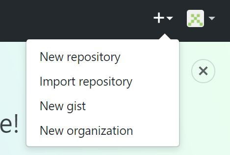
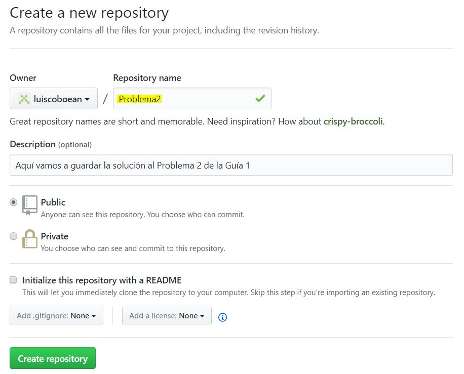
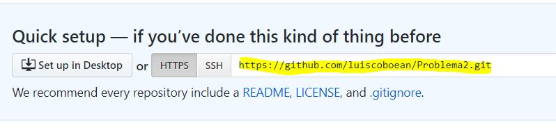
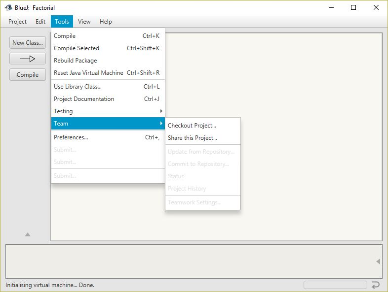
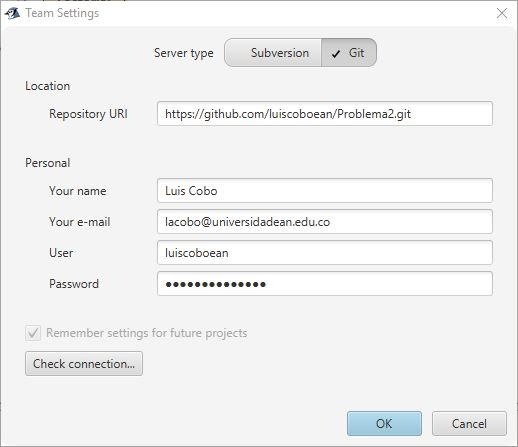

# Interacción de BlueJ con GitHub

Las diversas soluciones realizadas en el desarrollo de la Serie de Ejercicios de Programación deberán ser compartidas a través
de la plataforma GitHub. Esto le permitirá al tutor observar los programas realizados y poder analizarlos y darles retroalimentación
de manera sencilla y rápida. 

Entonces, por cada problema resuelto deberán realizar los siguientes pasos para compartir la solución al problema (el programa JAVA)
con su tutor.

## Crear un repositorio en GitHub
Primero, entre a GitHub usando su cuenta, y cree un repositorio. En la siguiente gráfica está el menú del sitio web donde está la 
opción que permite crear este repositorio. Un repositorio es una carpeta en su sitio web donde quedará almancenado sus proyectos.

Luego ingrese la información que se le solicita del nuevo repositorio. Tenga en cuenta sobre todo el nombre, ya que ese deberá
*anexarlo a su informe técnico* ya que le permitirá al tutor tener acceso a sus archivos.

Luego, ya debe aparecer la pantalla que indica que se creó el repositorio. Anote o guarde el URL que le aparece. Lo vamos a necesitar
para decirle a BlueJ donde almacenar nuestros archivos.

## Compartir en BlueJ

Ya creado el repositorio en GitHub, procedemos a guardar nuestro proyecto en el sitio web de GitHub desde BlueJ. Con el proyecto
abierto, escoja la opción *Share this Project...* del menú Tools / Team. 

En la ventana que aparece, escoja la opción Git, e ingrese la información solicitada. Tenga en cuenta el correo, el usuario y la
clave que utilizó al crear su cuenta en GitHub.

Presione *Check connection...* para verificar que su computador si pudo conectarse con el sitio web. Luego de dar OK, BlueJ sube 
el proyecto a GitHub, y listo! Todo bien. 
