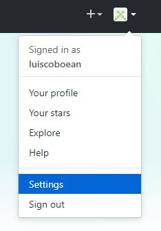
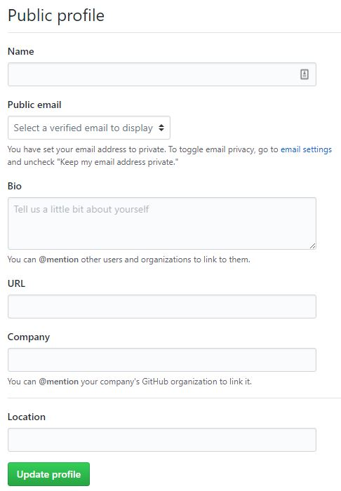

# Guía 01 - Git

Comencemos con la inscripción de cada estudiante en la plataforma GitHub. Para ello ingrese a la plataforma [GitHub](https://github.com/)
e inmediatamente, complete el formulario para la creación de la cuenta:

Utilice, por favor, su correo institucional para la creación de su cuenta en la plataforma. Al presionar el botón de _Sign up for GitHub_
les deberá aparecer lo siguiente:

Y ya que vamos a trabajar en la versión gratuita de la plataforma, podemos simplemente presionar el botón _Continue_ para pasar a la 
siguiente y última etapa de la creación de la cuenta.

Esta última página es para saber sus intereses específicos. Si lo desean, pueden escoger los elementos que le llaman la atención y sobre
los que les gustaría recibir mayor información, o escoger el enlace que dice __skip this step__ en la parte inferior del formulario. 
Luego de esto, ya tiene su cuenta creada en la plataforma GitHub, pero realicemos unos pasos adicionales para finalizar el trabajo de
configuración inicial.

En la parte superior derecha se encuentra el menú principal del sitio, escoja la opción de configuración o _Settings_ 

En la opción de configuración que aparece, complete los campos que se muestran en la figura a continuación. Sobre todo el nombre completo
y la compañía (Universidad EAN, por favor).

__En el informe técnico de la guía indique cuál es el nombre de usuario escogido para la plataforma__.
