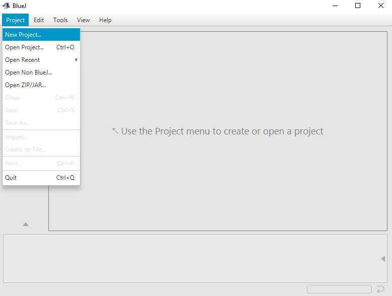
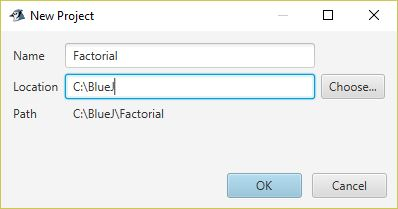
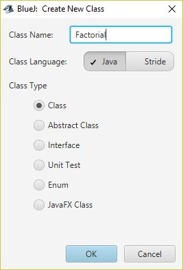
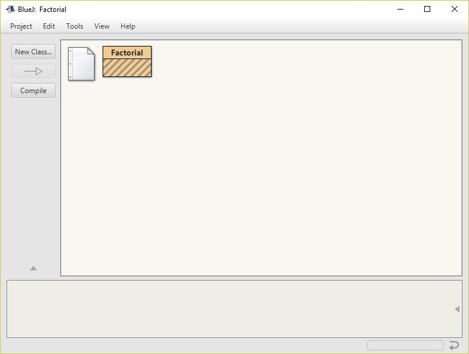
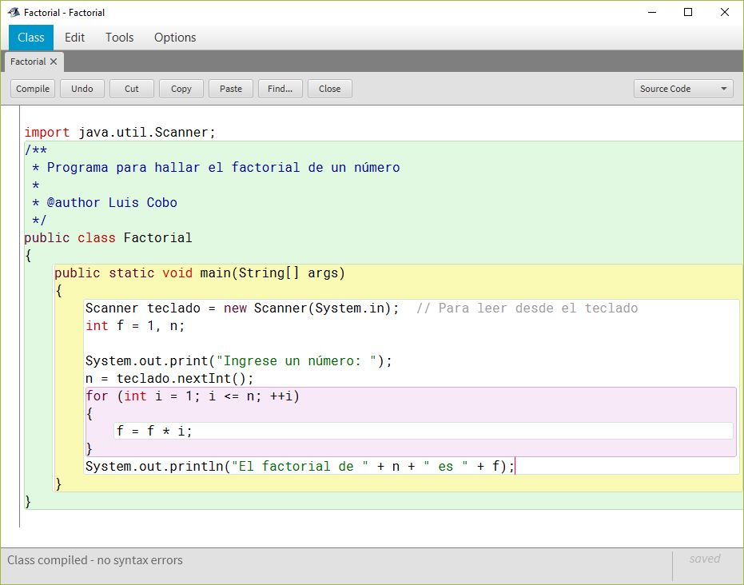
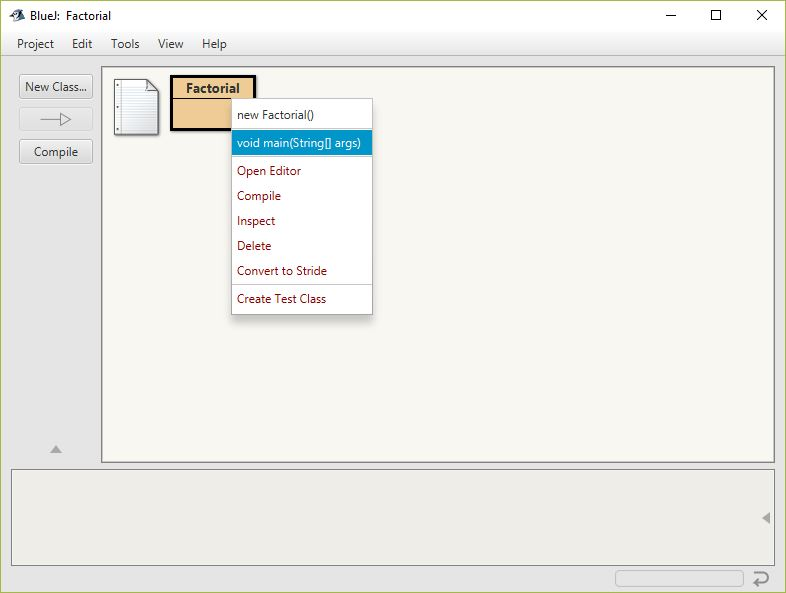
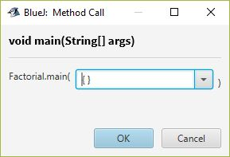
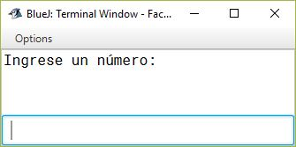
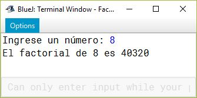

# Compilar y ejecutar programas Java en BlueJ
Esta es una guía rápida de como crear programas Java en BlueJ y luego ejecutarlos para verificar su funcionamiento.Este primer programa
solicitará al usuario un número y hallará e imprimirá el factorial de ese número. Tenga en cuenta que el factorial es la multiplicación
de todos los números enteros positivos desde 1 hasta el número en cuestión.

Lo primero que haremos en BlueJ es iniciar un nuevo proyecto. Lo vamos a llamar `Factorial`. La siguiente imagen nos presenta los pasos a
seguir:

Luego procedemos a construir una clase, que es la base de todo programa en Java. Vamos a llamar `Factorial` también a la clase que 
vamos a crear. En esa clase escribiremos el programa en cuestión. Ahora, para crear la clase, presione el botón __New Class...__ que
aparece a la izquierda y donde nos solicita el `Class Name:` ingresamos `Factorial` y luego presionamos el botón `OK`.

Ahora BlueJ debe ser algo como lo que tenemos en la siguiente figura. La caja café de rayas diagonales indica una clase no compilada aún
en Java. 

Al darle doble click a la caja café rayada, nos aparece el código Java correspondiente. El código que allí aparece es generado 
automáticamente por la herramienta, y no nos será de utilidad en esta ocasión. Borramos aquello que no nos sirve, y escribimos el 
programa que se encarga de generar el factorial de un número entero. La clase deberá tener un progama principal (que en Java se conoce
como un método `main`), donde solicitaremos al usuario el número y luego le hallaremos y mostraremos el factorial correspondiente.

En la esquina superior izquierda encontrará el botón `Compile`, el cual permite verificar que el programa esté correcto y muy bien
escrito. Al presionarlo, si no obtenemos error alguno, las rayas diagonales que poseía la clase deberán desaparecer. Ya puede cerrar
la clase presionando el botón `Close`. Ahora vamos a ejecutar el programa para verificar que se encuentra en un estado correcto y hace
lo que se le pide que haga. Sobre la caja que tiene el título `Factorial` hacer click con el botón derecho del mouse y escoger la opción
que dice `void main(String[] args)` que se refiere al programa que acabamos de escribir dentro de la clase. Tal como se muestra en la
siguiente imagen.

Luego simplemente presionamos `OK` en la ventana que se nos presenta inmediatamente, para asi dar inicio a nuestro programa.

Lo que tenemos frente a nosotros se denomina la "Consola" de nuestro programa. Aquí saldrán los mensajes al usuario, así como también
el usuario podrá ingresar información para el programa. 

Como vemos, el programa me está solicitando que ingrese un número. Lo único que debo hacer ahora es escribir un número entero cualquiera
(no muy grande, ya que Java limita el tamaño de los números enteros) y presionar `ENTER`, para que el programa procese el número y nos
muestre el factorial del mismo. En este ejemplo, ingresé el número 8, y obtuve el resultado que se muestra a continuación:

Listo! Si algo no funcionó como debería, solo tenemos que editar el archivo con la clase, realizar los cambios respectivos y volver a compilar y ejecutar. 
